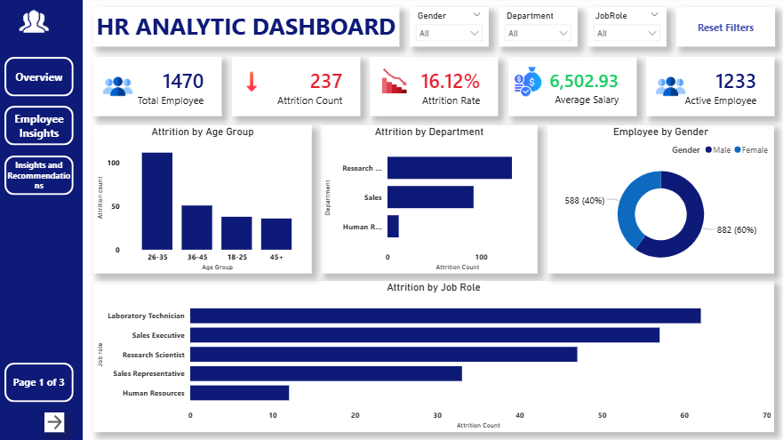
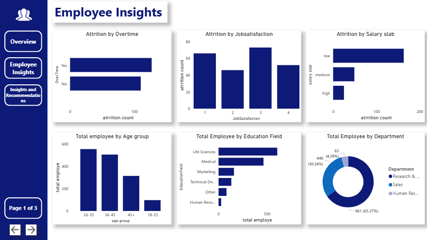
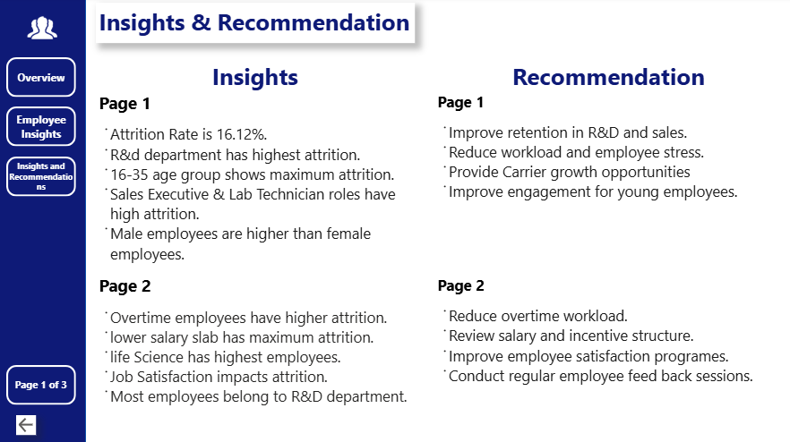

# IBM HR Analytics Dashboard

## Project Objective
This project analyzes employee attrition, job satisfaction, salary trends, and workforce performance using Power BI.

## Tools Used
- Power BI
- Excel
- DAX
- Power Query

## Key KPIs
- Total Employees
- Attrition Count
- Attrition Rate
- Average Age
- Average Salary
- Job Satisfaction

## Insights
- Higher attrition was observed in specific departments.
- Employees with lower job satisfaction showed higher attrition.
- Younger employees had a higher attrition rate.

## Recommendations
- Improve employee engagement programs.
- Focus on job satisfaction initiatives.
- Provide better career growth opportunities.

## Files Included
- Power BI Dashboard (.pbix)
- Dataset (.csv)
- Dashboard Screenshots# ibm-hr-dashboard-insights-recommendations
IBM HR Analytics Dashboard using Power BI with insights and recommendations.

# 📸 Dashboard Preview

## 🔹 Dashboard Page 1

---

## 🔹 Dashboard Page 2

---

## 🔹 Dashboard Page 3

